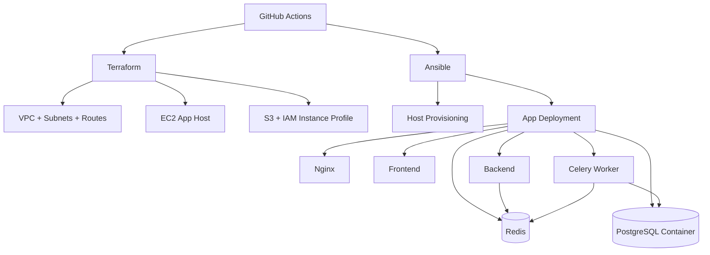
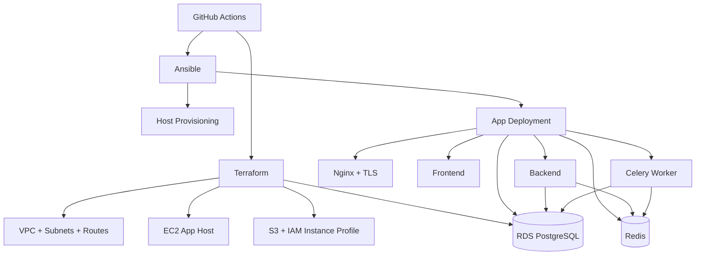

# World of Development of Opportunities and Change - Infrastructure

Infrastructure as Code repository for `development` and `staging` environments on AWS.

This repository combines:
- Terraform for provisioning cloud resources.
- Ansible for server provisioning and deployment orchestration.
- Docker Compose for runtime services.
- GitHub Actions for CI/CD automation.

## Table of Contents

- [Overview](#overview)
- [Architecture](#architecture)
- [Repository Structure](#repository-structure)
- [Prerequisites](#prerequisites)
- [Configuration Checklist](#configuration-checklist)
- [Terraform](#terraform)
- [Ansible](#ansible)
- [CI/CD Workflows](#cicd-workflows)
- [Runtime Services](#runtime-services)
- [Security Notes](#security-notes)
- [Troubleshooting](#troubleshooting)

## Overview

The repository manages two isolated environments:
- `development`
- `staging`

Design goals:
- Modular Terraform code: `network`, `compute`, `storage`, `database`.
- Clear split between infrastructure provisioning and app deployment.
- Reproducible deployment flow with rollback support during service updates.

## Architecture

### Development



### Staging



## Repository Structure

```text
.
|-- .github/
|   `-- workflows/
|       |-- deploy.yml
|       `-- infra-provision.yml
|-- ansible/
|   |-- deploy.yml
|   |-- inventory.ini
|   |-- provision.yml
|   |-- requirements.yml
|   |-- roles/
|   |   |-- app_deploy/
|   |   |-- host_setup/
|   |   |-- provision_ssl/
|   |   `-- server_tuning/
|   `-- templates/
|       |-- backend.env.j2
|       `-- database.env.j2
|-- terraform/
|   |-- environments/
|   |   |-- development/
|   |   `-- staging/
|   `-- modules/
|       |-- compute/
|       |-- database/
|       |-- network/
|       `-- storage/
|-- ansible.cfg
|-- docker-compose-development.yml
|-- docker-compose-staging.yml
|-- nginx-development.conf
|-- nginx-staging.conf
`-- README.md
```

## Prerequisites

Required tools:
- Terraform `>= 1.5`
- Ansible `>= 2.14`
- SSH client and key pair
- AWS CLI credentials with permissions for VPC/EC2/IAM/S3/RDS

Optional (local checks):
- Docker + Docker Compose plugin

## Configuration Checklist

Before first apply/deploy:

1) Terraform variables
- Update `terraform/environments/development/terraform.tfvars`
- Update `terraform/environments/staging/terraform.tfvars`
- Minimum values: `key_name`, `public_key_path`, `allowed_ssh_cidr`, `bucket_name`
- For staging RDS: `postgres_db`, `postgres_user`, `postgres_password`, `db_allocated_storage`, etc.

2) Ansible inventory
- Set real hosts in `ansible/inventory.ini` for both groups: `development`, `staging`
- Verify `ansible_user` and SSH connectivity

3) Deployment variables
- Required for templates/playbooks:
  - `dockerhub_user`, `dockerhub_token`
  - `secret_key`, `frontend_url`, `allowed_hosts`
  - `celery_broker_url`, `celery_result_backend`
  - `postgres_db`, `postgres_user`, `postgres_password`
  - `postgres_host` (mandatory for `staging`)

## Terraform

Run per environment.

Development:

```bash
cd terraform/environments/development
terraform init
terraform fmt -recursive
terraform validate
terraform plan -out tfplan
terraform apply tfplan
```

Staging:

```bash
cd terraform/environments/staging
terraform init
terraform fmt -recursive
terraform validate
terraform plan -out tfplan
terraform apply tfplan
```

Useful output:

```bash
terraform output
```

Typical outputs include EC2 host details, networking identifiers, IAM profile info, and RDS endpoint (staging).

## Ansible

Install required collections:

```bash
ansible-galaxy collection install -r ansible/requirements.yml
```

### Provisioning

`ansible/provision.yml` runs roles:
- `server_tuning` (sysctl/memory/service tuning)
- `host_setup` (Docker and base dependencies)
- `provision_ssl` (TLS/certificate setup when enabled)

Development:

```bash
ansible-playbook ansible/provision.yml \
  --limit development \
  --extra-vars "env_type=development enable_ssl=false domain_name="
```

Staging:

```bash
ansible-playbook ansible/provision.yml \
  --limit staging \
  --extra-vars "env_type=staging enable_ssl=true domain_name=staging.mydomain.com"
```

### Deployment

`ansible/deploy.yml` uses role `app_deploy`:
- Renders env files and copies environment-specific compose/nginx config.
- Auto-detects first run (`init`) via `.initialized` marker.
- Runs Django migrations on init and backend update.
- Performs automatic rollback when service update fails.

Example deploy:

```bash
ansible-playbook ansible/deploy.yml \
  --limit development \
  --extra-vars "env_type=development service_name=backend ..."
```

## CI/CD Workflows

Workflows live in `.github/workflows/`.

1) `deploy.yml`
- Trigger: `workflow_dispatch` or `repository_dispatch`.
- Resolves target env from dispatch payload/branch mapping.
- Runs Terraform drift check (`plan -refresh-only -detailed-exitcode`).
- Runs Trivy IaC scan for selected Terraform environment.
- Executes Ansible deploy with selected `service`.

2) `infra-provision.yml`
- Manual workflow to run host provisioning playbook.
- Supports `development`, `staging`, or `both`.

Minimum secrets:
- `AWS_ACCESS_KEY_ID`
- `AWS_SECRET_ACCESS_KEY`
- `SSH_PRIVATE_KEY`
- `DOCKERHUB_USERNAME`
- `DOCKERHUB_TOKEN`
- `POSTGRES_DB`, `POSTGRES_USER`, `POSTGRES_PASSWORD`, `POSTGRES_HOST`
- `BACKEND_SECRET_KEY`
- `FRONTEND_URL`
- `ALLOWED_HOSTS`
- `CELERY_BROKER_URL`
- `CELERY_RESULT_BACKEND`

## Runtime Services

Defined in compose files:
- `frontend`
- `backend`
- `celery`
- `redis`
- `nginx`
- `db` (development only)

Environment behavior:
- `development` uses containerized PostgreSQL (`db`).
- `staging` uses external RDS PostgreSQL.

Nginx routing:
- `/` -> frontend
- `/api` and `/admin` -> backend
- Staging config enables TLS using mounted Let's Encrypt certs.

## Security Notes

- Do not commit real secrets to `terraform.tfvars`, inventory, or templates.
- Restrict `allowed_ssh_cidr` to trusted IP ranges only.
- Rotate AWS, DockerHub, database, and app credentials regularly.
- Keep SSL enabled for internet-facing staging/prod-like environments.
- Review Trivy scan results before deployment promotion.

## Troubleshooting

1) Terraform init/backend errors
- Verify backend bucket and AWS credentials.

2) Drift check/deploy pipeline fails
- Check Terraform plan output for unexpected drift.
- Resolve IaC scan issues reported by Trivy.

3) Ansible SSH issues
- Verify `ansible_host`, `ansible_user`, security group rules, and SSH key.

4) Containers fail after deploy

```bash
cd /home/<ansible_user>/app
docker compose ps
docker compose logs --tail=200 backend
docker compose logs --tail=200 celery
docker compose logs --tail=200 redis
docker compose logs --tail=200 nginx
```

---

If you extend this repository for production, consider adding:
- Terraform state locking with DynamoDB,
- protected environments with approvals,
- monitoring and alerting (CloudWatch, notifications).
