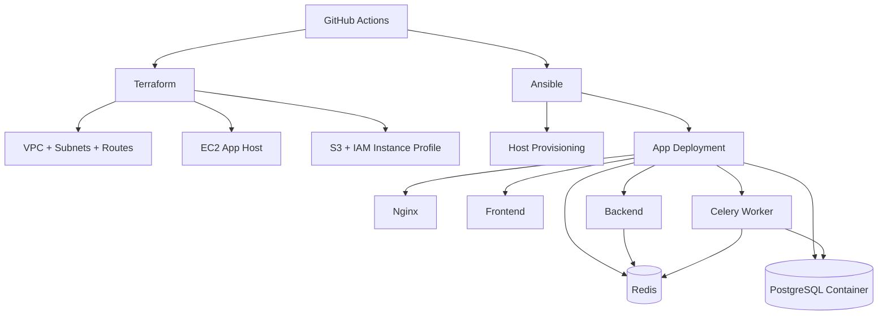
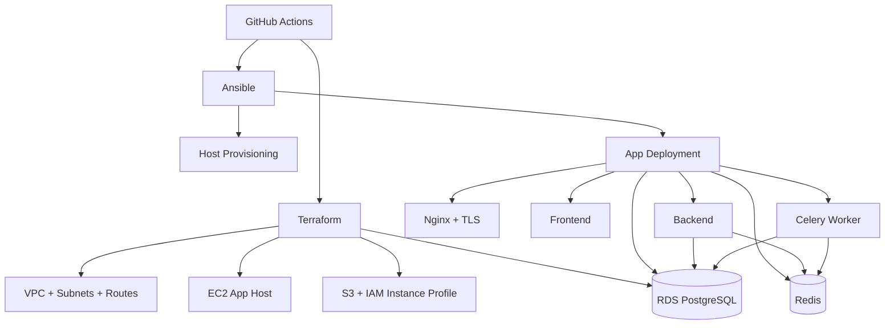

# World of Development of Opportunities and Change - Infrastructure

Infrastructure as Code repository for `development` and `staging` environments on AWS.

This repository combines:
- Terraform for provisioning cloud resources.
- Ansible for server provisioning and deployment orchestration.
- Docker Compose for runtime services.
- GitHub Actions for CI/CD automation.

## Table of Contents

- [Overview](#overview)
- [Architecture](#architecture)
- [Repository Structure](#repository-structure)
- [Prerequisites](#prerequisites)
- [Terraform](#terraform)
- [Ansible](#ansible)
- [CI/CD Workflows](#cicd-workflows)
- [Runtime Services](#runtime-services)
- [Local Compose Variants](#local-compose-variants)
- [Monitoring and Alerting](#monitoring-and-alerting)
- [Grafana Dashboards](#grafana-dashboards)
- [SMTP Email](#smtp-email)
- [Security Notes](#security-notes)
- [Troubleshooting](#troubleshooting)

## Overview

The repository manages two isolated environments:
- `development`
- `staging`

Design goals:
- Modular Terraform code: `network`, `compute`, `storage`, `database`.
- Clear split between infrastructure provisioning and app deployment.
- Reproducible deployment flow with rollback support during service updates.

## Architecture

### Development


```mermaid
flowchart TD
    GH[GitHub Actions] --> TF[Terraform]
    GH --> ANS[Ansible]

    TF --> VPC[VPC + Subnets + Routes]
    TF --> EC2[EC2 App Host]
    TF --> S3[S3 + IAM Instance Profile]

    ANS --> HOST[Host Provisioning]
    ANS --> DEPLOY[App Deployment]

    DEPLOY --> NGINX[Nginx]
    DEPLOY --> FE[Frontend]
    DEPLOY --> BE[Backend]
    DEPLOY --> CEL[Celery Worker]
    DEPLOY --> REDIS[(Redis)]
    DEPLOY --> DB[(PostgreSQL Container)]
    BE --> REDIS
    CEL --> REDIS
    CEL --> DB
```

### Staging


```mermaid
flowchart TD
    GH[GitHub Actions] --> TF[Terraform]
    GH --> ANS[Ansible]

    TF --> VPC[VPC + Subnets + Routes]
    TF --> EC2[EC2 App Host]
    TF --> S3[S3 + IAM Instance Profile]
    TF --> RDS[(RDS PostgreSQL)]

    ANS --> HOST[Host Provisioning]
    ANS --> DEPLOY[App Deployment]

    DEPLOY --> NGINX[Nginx + TLS]
    DEPLOY --> FE[Frontend]
    DEPLOY --> BE[Backend]
    DEPLOY --> CEL[Celery Worker]
    DEPLOY --> REDIS[(Redis)]
    DEPLOY --> RDS[(RDS PostgreSQL)]
    BE --> REDIS
    CEL --> REDIS
    BE --> RDS
    CEL --> RDS
```

## Repository Structure

```text
.
|-- .github/
|   `-- workflows/
|       |-- deploy.yml
|       `-- infra-provision.yml
|-- ansible/
|   |-- deploy.yml
|   |-- inventory.ini
|   |-- provision.yml
|   |-- requirements.yml
|   |-- roles/
|   |   |-- app_deploy/
|   |   |-- host_setup/
|   |   |-- provision_ssl/
|   |   `-- server_tuning/
|   `-- templates/
|       |-- backend.env.j2
|       |-- database.env.j2
|       `-- nginx.env.j2
|-- terraform/
|   |-- environments/
|   |   |-- development/
|   |   `-- staging/
|   `-- modules/
|       |-- compute/
|       |-- database/
|       |-- network/
|       `-- storage/
|-- ansible.cfg
|-- docker/
|   |-- development/
|   |   |-- docker-compose.infra.yml
|   |   |-- docker-compose.app.yml
|   |   `-- docker-compose.monitoring.yml
|   |-- staging/
|   |   |-- docker-compose.infra.yml
|   |   |-- docker-compose.app.yml
|   |   `-- docker-compose.monitoring.yml
|   |-- monitoring/
|   |   |-- loki-config.yaml
|   |   |-- promtail-config.yaml
|   |   |-- prometheus.yml
|   |   `-- grafana/
|   |       `-- provisioning/
|   `-- nginx/
|       `-- nginx.conf
`-- README.md
```

## Prerequisites

Required tools:
- Terraform `>= 1.5`
- Ansible `>= 2.14`
- SSH client and key pair
- AWS CLI credentials with permissions for VPC/EC2/IAM/S3/RDS

Optional (local checks):
- Docker + Docker Compose plugin

## Terraform

Run per environment.

Development:

```bash
cd terraform/environments/development
terraform init
terraform fmt -recursive
terraform validate
terraform plan -out tfplan
terraform apply tfplan
```

Staging:

```bash
cd terraform/environments/staging
terraform init
terraform fmt -recursive
terraform validate
terraform plan -out tfplan
terraform apply tfplan
```

Useful output:

```bash
terraform output
```

Typical outputs include EC2 host details, networking identifiers, IAM profile info, and RDS endpoint (staging).

## Ansible

Install required collections:

```bash
ansible-galaxy collection install -r ansible/requirements.yml
```

### Provisioning

`ansible/provision.yml` runs roles:
- `server_tuning` (sysctl/memory/service tuning)
- `host_setup` (Docker and base dependencies)
- `provision_ssl` (TLS/certificate setup when enabled)

Development:

```bash
ansible-playbook ansible/provision.yml \
  --limit development \
  --extra-vars "env_type=development enable_ssl=false domain_name="
```

Staging:

```bash
ansible-playbook ansible/provision.yml \
  --limit staging \
  --extra-vars "env_type=staging enable_ssl=true domain_name=staging.mydomain.com"
```

### Deployment

`ansible/deploy.yml` uses role `app_deploy`:
- Renders env files and copies environment-specific compose plus shared nginx config.
- Pulls and updates services via Docker Compose with healthcheck wait.
- Performs automatic rollback when service update fails.

Example deploy:

```bash
ansible-playbook ansible/deploy.yml \
  --limit development \
  --extra-vars "env_type=development service_name=backend ..."
```

Use `service_name=all` to update all services, or one of: `frontend`, `backend`.

## CI/CD Workflows

Workflows live in `.github/workflows/`.

1) `deploy.yml`
- Trigger: `workflow_dispatch` or `repository_dispatch`.
- Resolves target env from dispatch payload/branch mapping.
- Runs Trivy IaC scan for selected Terraform environment.
- Executes Ansible deploy with selected `service`.

2) `infra-provision.yml`
- Manual workflow to run host provisioning playbook.
- Supports `development`, `staging`, or `both`.

## GitHub Variables vs Secrets

Which repository settings to store where (recommended):

- Non-sensitive (GitHub Variables):
  - `DOCKERHUB_USERNAME`: example_user
  - `FRONTEND_URL`: http://localhost:3000
  - `EMAIL_HOST`: smtp.example.com
  - `EMAIL_PORT`: 587
  - `EMAIL_USE_TLS`: true
  - `DEFAULT_FROM_EMAIL`: noreply@example.com
  - `USE_S3`: false
  - `AWS_STORAGE_BUCKET_NAME`: my-bucket
  - `AWS_S3_REGION_NAME`: us-east-1
  - `SITE_DOMAIN`: example.com
  - `ADMIN_EMAIL`: admin@example.com
  - `ALLOWED_HOSTS`: localhost
  - `CSRF_TRUSTED_ORIGINS`: http://localhost:3000

- Sensitive (GitHub Secrets):
  - `AWS_ACCESS_KEY_ID`: <your-aws-key-id>
  - `AWS_SECRET_ACCESS_KEY`: <your-aws-secret>
  - `SSH_PRIVATE_KEY`: (PEM private key)
  - `POSTGRES_DB`, `POSTGRES_USER`, `POSTGRES_PASSWORD`, `POSTGRES_HOST`
  - `SECRET_KEY` (Django/Backend secret)
  - `DOCKERHUB_TOKEN`
  - `GRAFANA_PASSWORD`
  - `EMAIL_HOST_USER`, `EMAIL_HOST_PASSWORD`
  - `SLACK_WEBHOOK_URL`

Quick setup: Settings → Secrets and variables → Actions in the repository. Add non-sensitive defaults under "Variables" and credentials under "Secrets".

## Runtime Services

Defined in compose files:
- `frontend`
- `backend`
- `celery`
- `redis`
- `nginx`
- `db` (development only)

Environment behavior:
- `development` uses containerized PostgreSQL (`db`).
- `staging` uses external RDS PostgreSQL.

Nginx routing:
- `/` -> frontend
- `/api` and `/admin` -> backend
- TLS is enabled for both environments via `docker/nginx/nginx.conf`.
- Certificates are expected under `/etc/letsencrypt/live/<domain>/`.
- `SITE_DOMAIN` is injected at runtime via `nginx.env`.

## Local Compose Variants

Local developer workflows — use the compose files included under `docker/` depending on the scenario:

- `docker/local-full/docker-compose.yml` — full local stack (builds frontend + backend locally).
- `docker/development/docker-compose.app.yml` — app-compose for the development environment (build or pull app images).
- `docker/development/docker-compose.infra.yml` — infra services for development (redis, nginx, monitoring helpers).
- `docker/staging/docker-compose.app.yml` and `docker/staging/docker-compose.infra.yml` — staging variants that reference prebuilt images.

For most local development, prefer `docker/local-full/docker-compose.yml` which builds the application images locally; the environment-specific compose files under `docker/development` and `docker/staging` are intended for environment parity and CI use.

Examples:

```sh
docker compose -f docker/local-full/docker-compose.yml up -d
```

```sh
docker compose -f docker/development/docker-compose.app.yml up -d
```

```sh
docker compose -f docker/development/docker-compose.infra.yml up -d
```

Note: create environment files from the templates in `ansible/templates/` (or copy the examples) before bringing the stack up. Example:

```sh
cp ansible/templates/backend.env.j2 backend.env
cp ansible/templates/database.env.j2 database.env
cp ansible/templates/nginx.env.j2 nginx.env
# then edit values inside the copied files
```

## Monitoring and Alerting

Monitoring stack (Prometheus, Grafana, Loki, promtail, node-exporter, cAdvisor, nginx-exporter):

```sh
docker compose -f docker/monitoring/docker-compose.yml up -d
```

Promtail scrapes:
- Docker container logs: `/var/lib/docker/containers/*/*.log`
- System logs: `/var/log/*.log`

Grafana provisioning:
- Datasources are provisioned for Prometheus, Loki, and CloudWatch.
- Slack contact point is provisioned in `docker/monitoring/grafana/provisioning/alerting/contactpoints.yaml`.

Update the Slack webhook URL before deploying:
- Replace `${SLACK_WEBHOOK_URL}` with your actual incoming webhook.

## Grafana Dashboards

Planned dashboards (text-only design spec):
- **Platform Health:** node-exporter CPU, RAM, disk, and load with alert thresholds.
- **Docker Overview:** container restarts, container status, and log volume by service.
- **Backend API:** request rate, error rate, and latency (via `/metrics`).
- **Authentication:** successful logins and password reset requests over time.
- **Business Events:** event creation, comments, and likes (business counters).
- **User Growth:** registrations and profile creations split by profile type.
- **Nginx Overview:** active connections, total HTTP requests, exporter availability.
- **RDS Overview (CloudWatch):** CPU, connections, read/write latency, and free storage.

## SMTP Email

Email delivery is configured via SMTP providers:
- Set `EMAIL_HOST`, `EMAIL_PORT`, `EMAIL_HOST_USER`, `EMAIL_HOST_PASSWORD`, `DEFAULT_FROM_EMAIL`.

## Security Notes

- Do not commit real secrets to `terraform.tfvars`, inventory, or templates.
- Restrict `allowed_ssh_cidr` to trusted IP ranges only.
- Rotate AWS, DockerHub, database, and app credentials regularly.
- Keep SSL enabled for internet-facing staging/prod-like environments.
- Review Trivy scan results before deployment promotion.

## Troubleshooting

1) Terraform init/backend errors
- Verify backend bucket and AWS credentials.

2) Drift check/deploy pipeline fails
- Check Terraform plan output for unexpected drift.
- Resolve IaC scan issues reported by Trivy.

3) Ansible SSH issues
- Verify `ansible_host`, `ansible_user`, security group rules, and SSH key.

4) Containers fail after deploy

```bash
cd /home/<ansible_user>/app
docker compose ps
docker compose logs --tail=200 backend
docker compose logs --tail=200 celery
docker compose logs --tail=200 redis
docker compose logs --tail=200 nginx
```

---
