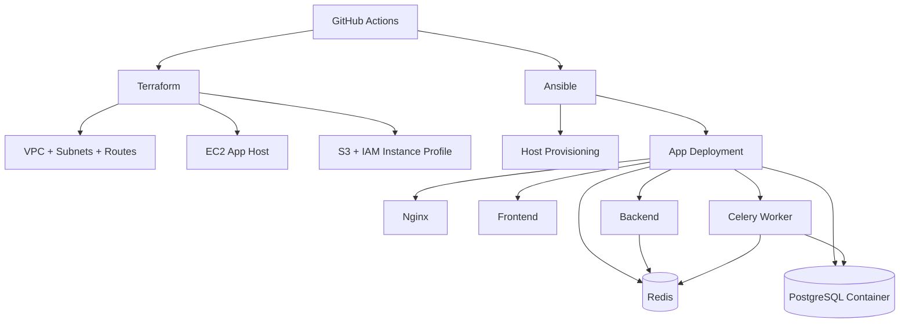
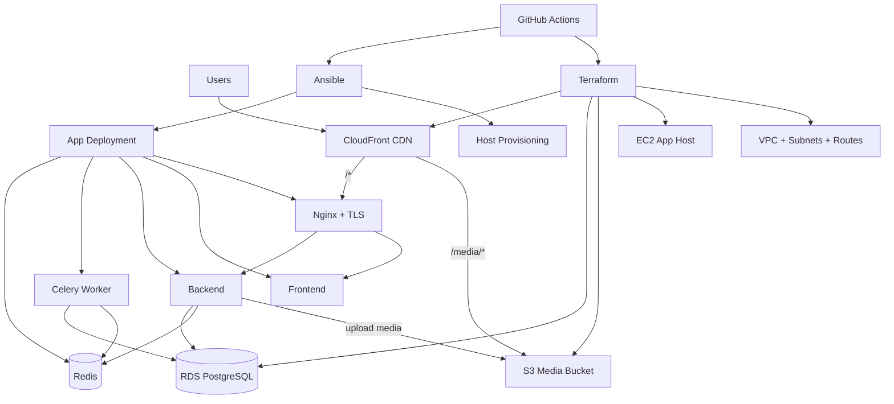
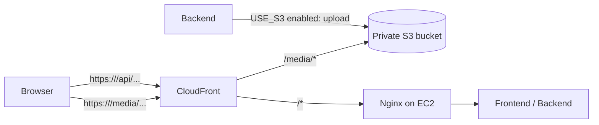

# World of Development of Opportunities and Change - Infrastructure

Infrastructure as Code repository for `development` and `staging` environments on AWS.

This repository combines:
- Terraform for provisioning cloud resources.
- Ansible for server provisioning and deployment orchestration.
- Docker Compose for runtime services.
- GitHub Actions for CI/CD automation.

## Table of Contents

- [Overview](#overview)
- [Architecture](#architecture)
- [Repository Structure](#repository-structure)
- [Prerequisites](#prerequisites)
- [Terraform](#terraform)
- [Ansible](#ansible)
- [CI/CD Workflows](#cicd-workflows)
- [GitHub Variables vs Secrets](#github-variables-vs-secrets)
- [Runtime Services](#runtime-services)
- [Media Delivery (Staging CDN)](#media-delivery-staging-cdn)
- [Monitoring and Alerting](#monitoring-and-alerting)
- [Grafana Dashboards](#grafana-dashboards)
- [SMTP Email](#smtp-email)
- [Security Notes](#security-notes)
- [Troubleshooting](#troubleshooting)

## Overview

The repository manages two isolated environments:
- `development`
- `staging`

Design goals:
- Modular Terraform code: `network`, `compute`, `storage`, `database`, `cdn`.
- Clear split between infrastructure provisioning and app deployment.
- Reproducible deployment flow with rollback support during service updates.

## Architecture

### Development


```mermaid
flowchart TD
    GH[GitHub Actions] --> TF[Terraform]
    GH --> ANS[Ansible]

    TF --> VPC[VPC + Subnets + Routes]
    TF --> EC2[EC2 App Host]
    TF --> S3[S3 + IAM Instance Profile]

    ANS --> HOST[Host Provisioning]
    ANS --> DEPLOY[App Deployment]

    DEPLOY --> NGINX[Nginx]
    DEPLOY --> FE[Frontend]
    DEPLOY --> BE[Backend]
    DEPLOY --> CEL[Celery Worker]
    DEPLOY --> REDIS[(Redis)]
    DEPLOY --> DB[(PostgreSQL Container)]
    BE --> REDIS
    CEL --> REDIS
    CEL --> DB
```

### Staging


```mermaid
flowchart TD
    User[Users] --> CDN[CloudFront CDN]
    CDN -->|"/media/*"| S3[S3 Media Bucket]
    CDN -->|"/*"| NGINX[Nginx + TLS]
    NGINX --> FE[Frontend]
    NGINX --> BE[Backend]

    GH[GitHub Actions] --> TF[Terraform]
    GH --> ANS[Ansible]

    TF --> VPC[VPC + Subnets + Routes]
    TF --> EC2[EC2 App Host]
    TF --> S3
    TF --> RDS[(RDS PostgreSQL)]
    TF --> CDN

    ANS --> HOST[Host Provisioning]
    ANS --> DEPLOY[App Deployment]

    DEPLOY --> NGINX
    DEPLOY --> FE
    DEPLOY --> BE
    DEPLOY --> CEL[Celery Worker]
    DEPLOY --> REDIS[(Redis)]
    BE -->|upload media| S3
    BE --> REDIS
    CEL --> REDIS
    BE --> RDS
    CEL --> RDS
```

## Repository Structure

```text
.
|-- .github/
|   `-- workflows/
|       |-- deploy.yml
|       `-- infra-provision.yml
|-- ansible/
|   |-- roles/
|   |   |-- app_deploy/
|   |   |   |-- defaults/
|   |   |   `-- tasks/
|   |   |       `-- main.yml
|   |   |-- host_setup/
|   |   |-- provision_ssl/
|   |   `-- server_tuning/
|   |-- templates/
|   |   |-- backend.env.j2
|   |   |-- database.env.j2
|   |   `-- nginx.conf.j2
|   |-- deploy.yml
|   |-- inventory.ini
|   |-- provision.yml
|   `-- requirements.yml
|-- docker/
|   |-- development/
|   |   `-- docker-compose.yml
|   `-- staging/
|       |-- docker-compose.monitoring.yml
|       `-- docker-compose.yml
|-- monitoring/
|   |-- grafana/
|   |   `-- provisioning/
|   |-- alert-rules.yml
|   |-- docker-compose.yml
|   |-- loki-config.yaml
|   |-- prometheus.yml
|   `-- promtail-config.yaml
|-- terraform/
|   |-- environments/
|   |   |-- development/
|   |   `-- staging/
|   `-- modules/
|       |-- cdn/
|       |-- acm/
|       |-- compute/
|       |-- database/
|       |-- network/
|       `-- storage/
|-- .gitignore
|-- ansible.cfg
`-- README.md
```

## Prerequisites

Required tools:
- Terraform `>= 1.5`
- Ansible `>= 2.14`
- SSH client and key pair
- AWS CLI credentials with permissions for VPC/EC2/IAM/S3/RDS/CloudFront

Optional (local checks):
- Docker + Docker Compose plugin

## Terraform

Run per environment (`<environment>`):

```bash
cd terraform/environments/<environment>
terraform init
terraform fmt -recursive
terraform validate
terraform plan -out tfplan
terraform apply tfplan
```

`<environment>` — `development` or `staging`.

Useful output:

```bash
terraform output
```

Typical outputs include EC2 host details, networking identifiers, IAM profile info, RDS endpoint, and `<cdn-domain>` (staging).

### Terraform modules

| Module | Purpose |
|---|---|
| `network` | VPC, subnets, routing |
| `compute` | EC2 app host, security group, SSH key |
| `storage` | S3 media bucket, EC2 IAM role for uploads |
| `database` | RDS PostgreSQL (staging only) |
| `cdn` | CloudFront distribution with dual origins (Nginx + S3) |
| `acm` | ACM certificate for viewer TLS on `<SITE_DOMAIN>` (staging) |

## Ansible

Install required collections:

```bash
ansible-galaxy collection install -r ansible/requirements.yml
```

### Provisioning

`ansible/provision.yml` runs roles:
- `server_tuning` (sysctl/memory/service tuning)
- `host_setup` (Docker and base dependencies)
- `provision_ssl` (TLS/certificate setup when enabled)

```bash
ansible-playbook ansible/provision.yml \
  --limit <environment> \
  --extra-vars "env_type=<environment> enable_ssl=<true|false> site_domain=<SITE_DOMAIN>"
```

`<environment>` — `development` or `staging`. `<SITE_DOMAIN>` — value of the `SITE_DOMAIN` GitHub Variable.

### Deployment

`ansible/deploy.yml` uses role `app_deploy`:

- **Dynamic config rendering:** The role dynamically renders environment variables (`backend.env`, `database.env`) and the web server configuration (`nginx.conf`) directly from Jinja2 templates at deploy time, rather than copying static files.
- **Separate stack orchestration:** For the staging environment, infrastructure concerns are clearly separated — the logging/monitoring stack is brought up in isolation, and application containers are deployed independently.
- **Image-state rollback:** A mechanism preserves and verifies the previous stable container image state, enabling automatic rollback if healthchecks fail for a new release.

Example deploy:

```bash
ansible-playbook ansible/deploy.yml \
  --limit <environment> \
  --extra-vars "env_type=<environment> service_name=<service> ..."
```

`<service>` — `all`, `frontend`, or `backend`.

## CI/CD Workflows

Workflows live in `.github/workflows/`.

1) `deploy.yml`
- Trigger: `workflow_dispatch` or `repository_dispatch`.
- Resolves target env from dispatch payload/branch mapping.
- Runs Trivy IaC scan for selected Terraform environment.
- Executes Ansible deploy with selected `service`.

2) `infra-provision.yml`
- Manual workflow to run host provisioning playbook.
- Supports `<environment>` values: `development`, `staging`, or `both`.

## GitHub Variables vs Secrets

| Notation | Description |
|---|---|
| `<SITE_DOMAIN>` | Public hostname (`SITE_DOMAIN` variable) |
| `<environment>` | `development` or `staging` |
| `<bucket>` | S3 bucket name (`AWS_STORAGE_BUCKET_NAME`) |
| `<region>` | AWS region (`AWS_S3_REGION_NAME`) |
| `<cdn-domain>` | CloudFront distribution domain (`terraform output cdn_domain_name`) |
| `<acm-certificate-arn>` | ACM certificate ARN for `SITE_DOMAIN` |
| `<ansible-user>` | SSH / deployment user on the EC2 host |

`SITE_DOMAIN` is the single public hostname for each environment. It is reused across Terraform (CDN aliases), Nginx TLS, SSL provisioning, and Django security settings. Ansible templates derive the following from `SITE_DOMAIN` and `env_type` (no separate GitHub Variables needed):

| Derived setting | Staging format | Development format |
|---|---|---|
| `FRONTEND_URL` | `https://<SITE_DOMAIN>` | `http://<host>:<port>` |
| `ALLOWED_HOSTS` | `<SITE_DOMAIN>` | `<host>,<SITE_DOMAIN>` |
| `CSRF_TRUSTED_ORIGINS` | `https://<SITE_DOMAIN>` | `http://<host>:<port>,https://<SITE_DOMAIN>` |

Which repository settings to store where (recommended):

- Non-sensitive (GitHub Variables):
  - `SITE_DOMAIN` — `<hostname>`
  - `DOCKERHUB_USERNAME` — `<dockerhub-username>`
  - `EMAIL_HOST` — `<smtp-host>`
  - `EMAIL_PORT` — `<port>`
  - `EMAIL_USE_TLS` — `<true|false>`
  - `DEFAULT_FROM_EMAIL` — `<email>`
  - `USE_S3` — `<true|false>`
  - `AWS_STORAGE_BUCKET_NAME` — `<bucket>`
  - `AWS_S3_REGION_NAME` — `<region>`
  - `ADMIN_EMAIL` — `<email>`

- Sensitive (GitHub Secrets):
  - `AWS_ACCESS_KEY_ID` — `<aws-access-key-id>`
  - `AWS_SECRET_ACCESS_KEY` — `<aws-secret-access-key>`
  - `SSH_PRIVATE_KEY` — `<pem-private-key>`
  - `POSTGRES_DB` — `<database-name>`
  - `POSTGRES_USER` — `<database-user>`
  - `POSTGRES_PASSWORD` — `<database-password>`
  - `POSTGRES_HOST` — `<database-host>`
  - `SECRET_KEY` — `<django-secret-key>`
  - `DOCKERHUB_TOKEN` — `<dockerhub-token>`
  - `GRAFANA_PASSWORD` — `<grafana-password>`
  - `EMAIL_HOST_USER` — `<smtp-username>`
  - `EMAIL_HOST_PASSWORD` — `<smtp-password>`
  - `SLACK_WEBHOOK_URL` — `<slack-webhook-url>`

Quick setup: Settings → Secrets and variables → Actions in the repository. Add non-sensitive defaults under "Variables" and credentials under "Secrets".

## Runtime Services

Defined in compose files:
- `frontend`
- `backend`
- `celery`
- `redis`
- `nginx`
- `db` (development only)

Environment behavior:
- `development` uses containerized PostgreSQL (`db`) and local media/static storage.
- `staging` uses external RDS PostgreSQL and S3 for media uploads.

Nginx routing:
- `/` -> frontend
- `/api` and `/admin` -> backend
- `/static/` -> local volume (both environments)
- `/media/` -> local volume (development only; staging media is served by CDN)
- **Development:** port 80 redirects to HTTPS; TLS via Let's Encrypt on `<SITE_DOMAIN>`.
- **Staging:** only port 443 is exposed on Nginx. HTTP→HTTPS for users is handled by CloudFront (`viewer_protocol_policy = redirect-to-https`). Let's Encrypt on EC2 secures the CDN→Nginx origin channel only.

## Media Delivery (Staging CDN)

Staging uses the Terraform `cdn` and `acm` modules (AWS CloudFront + ACM) as a transparent edge layer in front of the application and media storage.

### TLS split (staging only)

| Channel | Certificate | Purpose |
|---|---|---|
| User → CloudFront | **ACM** (`acm` module) | Browser-trusted HTTPS on `<SITE_DOMAIN>` |
| CloudFront → Nginx | **Let's Encrypt** on EC2 | Origin TLS on `<origin-prefix>.<SITE_DOMAIN>` (port 443, `https-only`) |
| CloudFront → S3 | **OAC** | Private media bucket access |

Users never see the EC2 certificate. HTTP requests to `http://<SITE_DOMAIN>` are redirected to HTTPS at the CloudFront edge — the request does not reach EC2.

CDN origin hostname: `<origin-prefix>.<SITE_DOMAIN>` (default prefix: `origin`). This record must point to the EC2 public IP and must **not** point to CloudFront (avoids an origin loop). `<SITE_DOMAIN>` points to CloudFront.

### Request flow


```mermaid
flowchart LR
    Browser -->|"https://<SITE_DOMAIN>/media/..."| CDN[CloudFront]
    Browser -->|"https://<SITE_DOMAIN>/api/..."| CDN
    CDN -->|"/media/*"| S3[(Private S3 bucket)]
    CDN -->|"/*"| Nginx[Nginx on EC2]
    Nginx --> App[Frontend / Backend]
    Backend -->|"USE_S3 enabled: upload"| S3
```

| Path | Origin | Purpose |
|---|---|---|
| `/*` (default) | Nginx (EC2) | Frontend, API, admin, static files |
| `/media/*` | S3 bucket | User-uploaded media files |

### Backend decoupling

The Django backend does **not** know about CloudFront or any CDN. It only switches storage via `USE_S3`:

| `USE_S3` | Storage backend | `MEDIA_URL` | Who serves files to users |
|---|---|---|---|
| `false` | local disk | `/media/` | Nginx (development) |
| `true` | S3 | `/media/` | CDN → S3 (staging) |

API responses contain relative URLs under `/media/<path>`. The browser resolves them as `https://<SITE_DOMAIN>/media/<path>`; the CDN routes `/media/*` to S3 without any CDN configuration in Python.

### S3 access control

Direct public access to the media bucket is blocked at multiple layers:

1. **S3 Public Access Block** — all four block flags enabled (`storage` module).
2. **Bucket ownership** — `BucketOwnerEnforced` prevents ACL-based public grants.
3. **Bucket policy** (`cdn` module) — `s3:GetObject` is allowed **only** for the CloudFront service principal bound to this distribution ARN (OAC).
4. **Deny insecure transport** — all `s3:*` over non-TLS is denied.

A direct S3 object URL (`https://<bucket>.s3.<region>.amazonaws.com/media/<path>`) returns **403 Forbidden**. Only the CDN distribution can read objects. The EC2 instance retains IAM write access for uploads but cannot expose files publicly.

### Infrastructure variables

| Layer | How domains are used |
|---|---|
| Terraform `acm` | ACM certificate for `<SITE_DOMAIN>` (viewer TLS) |
| Terraform `cdn` | CDN alias, `https-only` origin to `<origin-prefix>.<SITE_DOMAIN>` |
| Route53 (optional) | `route53_zone_id` — auto ACM validation, origin A record, site CDN alias |
| Nginx (staging) | Port 443 only; `server_name` covers `<SITE_DOMAIN>` and origin hostname |
| SSL provisioning | Certbot issues LE cert for `<SITE_DOMAIN>` + origin hostname |
| Django | `ALLOWED_HOSTS`, `CSRF_TRUSTED_ORIGINS`, `FRONTEND_URL` (derived in Ansible) |

Terraform variables in `terraform/environments/staging/terraform.tfvars`:

| Variable | Format |
|---|---|
| `site_domain` | `<SITE_DOMAIN>` |
| `origin_prefix` | `<origin-prefix>` |
| `route53_zone_id` | `<route53-zone-id>` or empty for manual DNS |

### CDN setup checklist (staging)

1. Apply Terraform:

```bash
cd terraform/environments/staging
terraform apply
```

2. If `route53_zone_id` is empty, add DNS records manually:
   - ACM validation CNAMEs from `terraform output acm_validation_records`
   - A record: `<origin-prefix>.<SITE_DOMAIN>` → EC2 public IP (`terraform output instance_public_ip`)
   - ALIAS/CNAME: `<SITE_DOMAIN>` → `<cdn-domain>` (`terraform output cdn_domain_name`)
   - Re-run `terraform apply` after ACM validation completes

3. Run SSL provisioning on EC2 (includes origin hostname in the LE certificate).

4. Set GitHub Variables and redeploy via `deploy.yml`.

## Monitoring and Alerting

Monitoring stack (Prometheus, Grafana, Loki, promtail, node-exporter, cAdvisor, nginx-exporter):

```sh
docker compose -f monitoring/docker-compose.yml up -d
```

> **Note:** To optimize server resource usage, the monitoring stack (Prometheus, Grafana, Loki, etc.) is managed by Ansible tasks and is deployed **only on the staging environment**. On development, the monitoring infrastructure is fully ignored and not brought up.

Promtail scrapes:
- Docker container logs: `/var/lib/docker/containers/*/*.log`
- System logs: `/var/log/*.log`

Grafana provisioning:
- Datasources are provisioned for Prometheus, Loki, and CloudWatch.
- Slack contact point is provisioned in `monitoring/grafana/provisioning/alerting/contactpoints.yaml`.

Update the Slack webhook URL before deploying (see `SLACK_WEBHOOK_URL` secret).

## Grafana Dashboards

Planned dashboards (text-only design spec):
- **Platform Health:** node-exporter CPU, RAM, disk, and load with alert thresholds.
- **Docker Overview:** container restarts, container status, and log volume by service.
- **Backend API:** request rate, error rate, and latency (via `/metrics`).
- **Authentication:** successful logins and password reset requests over time.
- **Business Events:** event creation, comments, and likes (business counters).
- **User Growth:** registrations and profile creations split by profile type.
- **Nginx Overview:** active connections, total HTTP requests, exporter availability.
- **RDS Overview (CloudWatch):** CPU, connections, read/write latency, and free storage.

## SMTP Email

Email delivery is configured via SMTP providers — set `EMAIL_HOST`, `EMAIL_PORT`, `EMAIL_HOST_USER`, `EMAIL_HOST_PASSWORD`, and `DEFAULT_FROM_EMAIL` (see [GitHub Variables vs Secrets](#github-variables-vs-secrets)).

## Security Notes

- Do not commit real secrets to `terraform.tfvars`, inventory, or templates.
- Restrict `allowed_ssh_cidr` to trusted IP ranges only.
- Rotate AWS, DockerHub, database, and app credentials regularly.
- Keep SSL enabled for internet-facing staging/prod-like environments.
- Review Trivy scan results before deployment promotion.
- S3 media bucket is private: only the CDN distribution can read objects via OAC; direct S3 URLs return 403.
- `SITE_DOMAIN` is the single source of truth for the public hostname — do not duplicate it as `FRONTEND_URL`, `ALLOWED_HOSTS`, or `CSRF_TRUSTED_ORIGINS`.

## Troubleshooting

1) Terraform init/backend errors
- Verify backend bucket and AWS credentials.

2) Drift check/deploy pipeline fails
- Check Terraform plan output for unexpected drift.
- Resolve IaC scan issues reported by Trivy.

3) Ansible SSH issues
- Verify `ansible_host`, `ansible_user`, security group rules, and SSH key.

4) Media files return 403 on staging
- Confirm `USE_S3`, `AWS_STORAGE_BUCKET_NAME`, and `SITE_DOMAIN` are set in GitHub Variables.
- Verify Terraform applied the S3 bucket policy from the `cdn` module.
- Check that uploaded files exist in the bucket at `media/<path>`.
- Ensure `<SITE_DOMAIN>` DNS points to `<cdn-domain>` (not directly to EC2).
- Verify that `https://<bucket>.s3.<region>.amazonaws.com/media/<path>` returns 403.

5) Containers fail after deploy

```bash
cd /home/<ansible_user>/app
docker compose ps
docker compose logs --tail=200 backend
docker compose logs --tail=200 celery
docker compose logs --tail=200 redis
docker compose logs --tail=200 nginx
```

---
